# 👤 Flujo de Usuarios

> Sistema completo de creación de usuarios, primer ingreso, cambio de contraseña y bloqueo/desbloqueo.

---

## Diagrama de Flujo

```mermaid
graph TD
    subgraph "Creación de Usuario"
        A[Superadmin en /dashboard/usuarios] --> B[POST /api/usuarios]
        B --> C[Crear en Firebase Auth]
        C --> D[Crear en Firestore users/uid]
        D --> E{¿Rol?}
        E -->|admin| F[primerInicio: false]
        E -->|barber| G[primerInicio: true]
        F --> H[Usuario listo]
        G --> H
    end

    subgraph "Primer Inicio (Barbero)"
        I[Barbero inicia sesión] --> J[AuthContext obtiene rol y datos]
        J --> K[AuthGuard verifica]
        K --> L{primerInicio === true?}
        L -->|SÍ| M[Redirige a /cambiar-contrasena]
        L -->|NO| N[Redirige al dashboard]
        M --> O[Formulario de cambio de contraseña]
        O --> P[PATCH /api/usuarios/uid/cambiar-contrasena]
        P --> Q[Actualiza contraseña en Auth]
        Q --> R[primerInicio: false en Firestore]
        R --> S[Redirige al dashboard]
    end

    subgraph "Bloqueo/Desbloqueo"
        T[Superadmin bloquea usuario en /dashboard/usuarios]
        T --> U[bloqueado: true en Firestore]
        U --> V[onSnapshot en AuthContext detecta cambio]
        V --> W[AuthGuard redirige a /bloqueado]
        W --> X[Usuario ve mensaje de bloqueo]
        Y[Superadmin desbloquea usuario]
        Y --> Z[bloqueado: false en Firestore]
        Z --> AA[onSnapshot detecta cambio]
        AA --> AB[AuthGuard permite acceso al dashboard]
    end
```



---

## Flujo Completo Paso a Paso

### 1. Creación de Usuario (Superadmin)

Solo el **superadmin** puede crear usuarios desde `/dashboard/usuarios` o vía `POST /api/usuarios`.

**Campos requeridos**: email, password, name, phone, role (`admin` | `barber`)

**Al crear**:
- Se crea el usuario en Firebase Auth
- Se crea el documento en Firestore `users/{uid}` con:
  - `primerInicio: true` si el rol es `barber`, `false` si es `admin` o `superadmin`
  - `bloqueado: false`
  - `creadoEn: new Date().toISOString()`
  - `creadoPor: uid del superadmin`
- Se crea cuenta bancaria en `bank/{uid}` (solo admin y barber)

### 2. Primer Inicio de Sesión (Barbero)

Cuando un barbero recién creado inicia sesión:

1. **Firebase Auth** autentica las credenciales (con timeout de 10s — si excede, muestra error "La autenticación está tomando demasiado tiempo")
2. **Cliente**: Obtiene un ID token con `getIdToken()` y setea la cookie `firebase-token` para el middleware de Next.js
3. **Cliente**: Redirige inmediatamente a `/dashboard` con `router.replace()` (no espera a `onAuthStateChanged`)
4. **AuthContext** obtiene el documento `users/{uid}` de Firestore mediante `onSnapshot`
5. **AuthGuard** (que envuelve todas las rutas del dashboard) verifica en orden:
   - ¿Está cargando? → Muestra spinner
   - ¿Está autenticado? → Si no, redirige a `/login`
   - ¿`primerInicio === true` y rol es `barber`? → Redirige a `/cambiar-contrasena`
   - ¿`bloqueado === true`? → Redirige a `/bloqueado`
   - ¿Rol autorizado? → Renderiza la ruta

### 3. Cambio de Contraseña

La página `/cambiar-contrasena` muestra un formulario con:
- Campo para nueva contraseña (mínimo 6 caracteres)
- El usuario DEBE cambiar su contraseña temporal

Al enviar:
1. Llama a `PATCH /api/usuarios/[uid]/cambiar-contrasena`
2. El endpoint verifica que el token coincida con el `uid` de la URL
3. Valida que la nueva contraseña tenga al menos 6 caracteres
4. Actualiza la contraseña en Firebase Auth (Admin SDK)
5. Marca `primerInicio: false` en Firestore
6. **Cliente**: Re-autentica al usuario con `signInWithEmailAndPassword(auth, email, nuevaPassword)` para evitar que el Admin SDK invalide la sesión
7. **Cliente**: Obtiene un token fresco con `getIdToken()` y renueva la cookie `firebase-token`
8. Redirige a `/dashboard` con `window.location.href` (carga completa para garantir datos frescos de Firestore)

> [!WARNING] Re-autenticación obligatoria
> El cambio de contraseña vía Admin SDK (`adminAuth.updateUser`) puede invalidar el refresh token del usuario. Si no se re-autentica con las nuevas credenciales, al recargar la página el middleware de Next.js no encontrará la cookie y redirigirá al login. Siempre se debe llamar a `signInWithEmailAndPassword` tras el cambio.

### 4. Bloqueo/Desbloqueo de Usuarios

El superadmin puede bloquear o desbloquear usuarios desde `/dashboard/usuarios`:

**Bloquear**:
1. Superadmin activa el toggle de bloqueo → `bloqueado: true` en Firestore
2. `onSnapshot` en AuthContext detecta el cambio instantáneamente
3. AuthGuard redirige al usuario bloqueado a `/bloqueado`
4. La página `/bloqueado` muestra un mensaje informativo

**Desbloquear**:
1. Superadmin desactiva el toggle → `bloqueado: false` en Firestore
2. `onSnapshot` detecta el cambio
3. AuthGuard permite el acceso normal al dashboard

### 5. Usuarios Admin

Los usuarios con rol `admin` NO pasan por el flujo de primer inicio:
- Al ser creados, `primerInicio` se establece en `false`
- Inician sesión y van directamente al dashboard
- Tienen acceso completo al negocio pero NO pueden gestionar usuarios

---

## AuthGuard: Orden de Verificación

El componente `AuthGuard` (`src/components/providers/AuthGuard.tsx`) es el guardián central de todas las rutas protegidas:

```
1. LOADING        → Muestra spinner mientras carga auth y Firestore
2. NO AUTENTICADO → Redirige a /login
3. PRIMER INICIO  → Redirige a /cambiar-contrasena (solo barberos)
4. BLOQUEADO      → Redirige a /bloqueado
5. ROLES          → Verifica permisos para la ruta específica
```

**Rutas públicas** (sin AuthGuard): `/login`, `/bloqueado`, `/cambiar-contrasena`

---

## Páginas Especiales

| Ruta | Descripción | Acceso |
|---|---|---|
| `/login` | Inicio de sesión | Público |
| `/bloqueado` | Mensaje de cuenta bloqueada | Usuario bloqueado |
| `/cambiar-contrasena` | Formulario cambio de contraseña | Barbero en primer inicio |
| `/dashboard/usuarios` | Gestión de usuarios | Solo superadmin |

---

## API Endpoints Involucrados

| Método | Endpoint | Acceso |
|---|---|---|
| `GET` | `/api/usuarios` | superadmin |
| `POST` | `/api/usuarios` | superadmin |
| `PATCH` | `/api/usuarios/[uid]` | superadmin |
| `DELETE` | `/api/usuarios/[uid]` | superadmin |
| `PATCH` | `/api/usuarios/[uid]/cambiar-contrasena` | Propio usuario |

Ver [[API]] para la documentación completa de cada endpoint.

---

## Campos en Firestore `users/{uid}`

| Campo | Tipo | Descripción |
|---|---|---|
| `uid` | string | ID del usuario |
| `email` | string | Correo electrónico |
| `name` | string | Nombre completo |
| `phone` | string | Teléfono |
| `role` | `"superadmin"` \| `"admin"` \| `"barber"` | Rol del usuario |
| `primerInicio` | boolean | `true` = debe cambiar contraseña |
| `bloqueado` | boolean | `true` = acceso denegado |
| `creadoEn` | string | Fecha ISO de creación |
| `creadoPor` | string? | UID del superadmin creador |

---

## Ver también
- [[Roles y Permisos]]
- [[Reglas de Seguridad]]
- [[API]]
- [[Base de Datos]]
- [[Arquitectura del Sistema]]
- [[Modulos del Sistema]]
